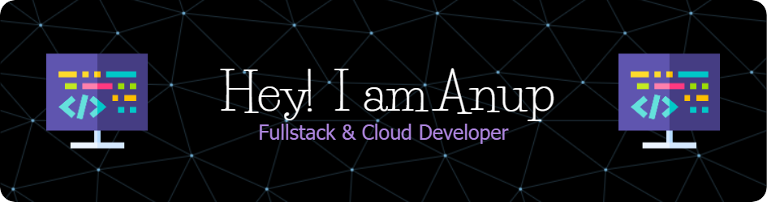

<!-- Name banner -->

  

<h1 align="center">Hi 👋, I'm Anup Kumar Shaw</h1>

  

  

---

### 🚀 About Me

Software Developer at **[Anocloud](https://anocloud.in)** — building multi-tenant SaaS serving **10+ enterprise clients** on **NestJS, Next.js, and GCP**: secure backends, POS/SAP synchronization pipelines, and AI/LLM-integrated platforms across retail, healthcare, and finance.

- 🔭 Currently building: **AI-powered content platforms** and **multi-tenant SaaS** on GCP
- ☁️ **4x Google Cloud Certified** — Cloud Architect, ML Engineer, Cloud Database Engineer, Associate Cloud Engineer
- 🌱 Currently exploring: **Advanced DevOps, LLM integrations & agentic AI workflows**
- 💬 Ask me about: **NestJS, Next.js, TypeScript, PostgreSQL, Prisma, GCP, MERN**
- 🎓 B.Tech in Information Technology — RCC Institute of Information Technology, Kolkata (2024)
- 📍 Howrah, West Bengal, India
- 📫 Reach me at: **anupshaw1603@gmail.com**
- ⚡ Fun fact: I love building real-world apps that solve real problems!

---

### 🛠️ Tech Stack

#### 💻 Languages

  

#### 🌐 Frontend & Mobile

  

#### ⚙️ Backend

  

#### 🗃️ Databases & Caching

  

#### ☁️ Cloud & DevOps

  

#### 🤖 AI & Tools

  
  &nbsp;
  
  

---

### 🏅 Google Cloud Certifications

| Certification                              | Year |
| ------------------------------------------ | ---- |
| 🧠 Professional Machine Learning Engineer  | 2026 |
| 🏛️ Professional Cloud Architect            | 2026 |
| 🗄️ Professional Cloud Database Engineer    | 2025 |
| ⚙️ Associate Cloud Engineer                | 2024 |

---

### 📂 Featured Projects

| Project                                                                          | Tech Stack                                             | Highlights                                                                                                                              |
| -------------------------------------------------------------------------------- | ------------------------------------------------------ | --------------------------------------------------------------------------------------------------------------------------------------- |
| 🤖 AI-Powered LinkedIn Content Assistant                                          | NestJS, Next.js, Prisma, PostgreSQL, Gemini AI, Docker | Generate, edit, schedule & publish LinkedIn content from a centralized knowledge base — **~70% drafting-time reduction** with a provider-agnostic AI layer |
| 💸 Multi-Tenant Invoice Generation Platform                                       | NestJS, Prisma, PostgreSQL, WebSockets, Docker, GCP    | Production invoicing with GST compliance & real-time updates — **10+ companies onboarded, 100% tenant data isolation**                    |
| 🏥 [Hospital Visitor Tracking System](https://github.com/Anup1603/HVM_Backend)    | NestJS, Next.js, Prisma, GCP                           | End-to-end visitor tracking with optimized GCP deployment — **300ms latency reduction**, complete architecture ownership                  |
| 🏠 [Tenant Management System](https://github.com/Anup1603/TMS)                    | MERN, JWT, MongoDB Atlas                               | Property & tenant management portal with efficient tracking, automation, and secure access                                               |
| 📝 [NoteZipper](https://github.com/Anup1603/Note_Zipper_Frontend)                 | MERN, JWT, MongoDB                                     | Note management system with secure login and full CRUD                                                                                    |

---

### 📈 GitHub Stats

  

  

  

---

### 📫 Let's Connect

  
  &nbsp;
  
  &nbsp;
  
  &nbsp;
  
  &nbsp;
  

---

<i>✨ Made with ❤️ by Anup Kumar Shaw</i>

